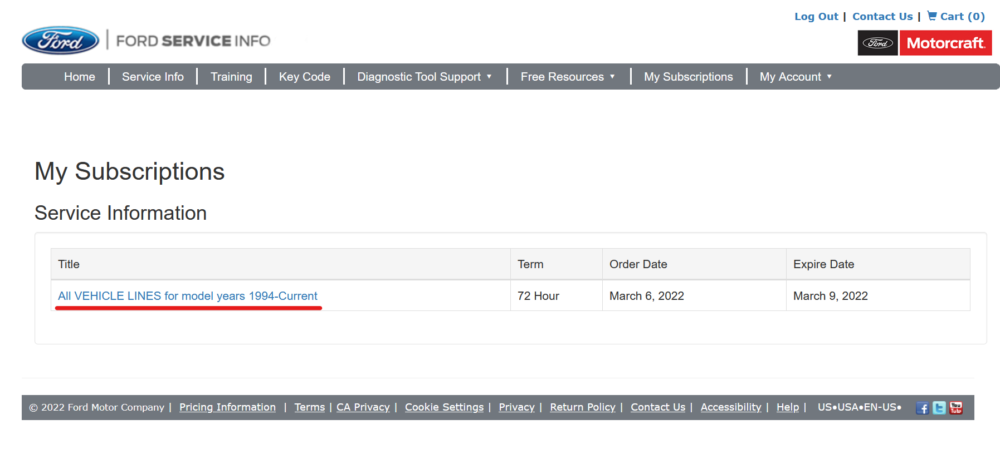

# fetch-ford-service-manuals

 Downloads HTML and PDF versions of Ford Service Manuals from PTS.

Bought a 72-hour subscription to Ford's service manuals and want to save it permanently?
Here's the repo for you.

These manuals are copyrighted by Ford, so don't share them!

## Table of Contents

- [Usage](#Usage)
- [Results (what do I get out of this?)](#results)
- [FAQ](#faq)

## Usage

Getting this to work currently requires some knowledge of browser DevTools.
If you're not sure how to use them, ask a friend who does.

Also, I **highly** recommend using macOS or another POSIX operating system (tested and working on both macOS and Ubuntu on WSL2).
This library uses [`playwright`](https://github.com/microsoft/playwright), a headless browser interop library, to save documents
as PDF files rather than raw HTML (this way files include images), and Playwright often works better on POSIX systems.

### Set up Node (>16.3) and Yarn

1. Install Node.js 16.3 or newer (with `corepack`)
2. Run `corepack enable`

### Get code and dependencies

1. Clone this repository with `git clone https://github.com/iamtheyammer/fetch-ford-service-manuals.git`
2. Run `yarn install` to download dependencies
3. Run `yarn playwright-setup` to download and set up Playwright

### Get data for your car

This library requires some data about your car that's not available in the PTS GUI in order to fetch the correct manual.

1. If you haven't, purchase a PTS subscription from [here](https://www.motorcraftservice.com/Purchase/ViewProduct). The 72 hour subscription is fine.
2. Once purchased, go to PTS: click [here](https://www.motorcraftservice.com/MySubscriptions), then click on your subscription title. .
3. Once PTS opens, navigate to your car.
    - **Do not use your VIN.**
    - On the left, choose *By Year & Model*, then select your car's year and model.
    - Press GO once selected.
4. Open DevTools, and navigate to the Network tab.
5. Click on the Workshop tab in PTS.
6. Filter for the one POST to `https://www.fordservicecontent.com/Ford_Content/PublicationRuntimeRefreshPTS//publication/prod_1_3_372022/TreeAndCover/workshop/32/~WSLL/{some numbers here}`. It should look similar to the request in [this photo](img/workshop-request.png).
7. Click on that request, and look at the sent form data.
8. Open [`templates/params.json`](templates/params.json), and copy information from that request into the values of the JSON `.workshop` field.
    - **Do not add fields. Only change values.**
    - Change the values to match. You probably won't need to change anything under the line break.
    - If you can't find the Book Title or Wiring Book Title, look in the query string parameters. **Do not leave them blank!**
9. Clear the DevTools Network pane (click on the Trash Can)
10. Click the Wiring tab at the top of PTS.
11. Filter for the GET request to this URL: `https://www.fordservicecontent.com/Ford_Content/PublicationRuntimeRefreshPTS//wiring/TableofContent` (there are query params at the end, that's ok). It should look similar to the request in [this photo](img/wiring-request.png).
12. Copy the `environment` and `bookType` query params into `.wiring` in `params.json`.
13. Save `params.json` and open `cookieString.txt`
14. Clear the content in `cookieString.txt`, and replace it with the **value** of the `Cookie` header sent in the `TableofContent` request (step 11).
    - Do **not** include the name (`cookieString.txt` should **not** include `Cookie:`, for example.)
    - NOTE: In Firefox, you MUST enable the *Raw* toggle at the top right of Response Headers, then copy it from there. If you don't, you'll get an invalid character error when trying to fetch wiring diagrams.
15. Save `cookieString.txt`.

### Download the manual!

To download the manual, run `yarn start -c templates/params.json -s templates/cookieString.txt -o /directory/where/you/want/the/downloaded/manual/`. You should see output that looks like [this](img/example-output.png).

Make sure that the directory for the downloaded manual is empty-- it'll have lots of subfolders.

You can get more param information by running `yarn start --help`.

It can take a little while! On a fast computer with a fast internet connection, and, more importantly, a fast disk drive, over 15 minutes to download the manuals for the 2005 Taurus. Be patient!

Also, the resulting folder is pretty sizeable. The folder for the 2005 Taurus was about 300mb, and the F150 folder was a couple gigabytes.

## Results

This bot downloads the **entire** workshop manual and **all** wiring diagrams for the vehicle you set up.

The folder structure in the output directory will mimic the structure on PTS, so if a file has a path like `1: General Information -> 00: Service Information -> 100-00 General Information -> About this Manual`, it will be in the folder `outputpath/1: General Information/00: Serivce Information/100-00 General Information/About this Manual.html`.

You'll notice both a `.pdf` and a `.html` file for each manual page. PDF files are often easier to share and view, especially on mobile devices. They also include images in case Ford decides to change how images are stored in the future.

Wiring diagrams will be in `outputpath/Wiring`.

The `cover.html` file contains the book's cover. If you want to see a somewhat visual table of contents, you can open it in a text editor and change this line `
` to `
`. Then, open it in a browser.

The `toc.json` file contains the computer-readable table of contents, with the name mapped to the "document number", which is used to fetch the PDF. Not sure how useful it is, honestly, but it was helpful while debugging.

## FAQ

Questions I think someone might ask, not questions anyone has ever asked before.

### Which vehicles does this work with?

All the ones I've tested. Just for fun, I tried:

- 2006 Taurus/Sable
- 2008 Mustang
- 2020 MKZ
- 2022 F-150

All worked flawlessly!

### Why did you make this?

I wanted to have the manual for my car, and I bought the subscription hoping to download a PDF, so that's exactly what I did!

### The code doesn't look that great

Yeah, this was a quick weekend project. Feel free to make it better, though!

### Why do you fetch pages one-at-a-time?

Two reasons. Firstly, I don't want to DDoS Ford (they also have Akamai in front of this, and a ton of parallel requests would absolutely trigger it and get us blocked). Secondly, it was easier to code synchronously.